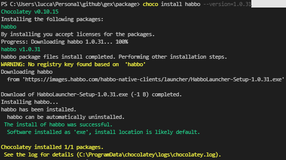
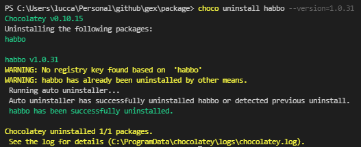

Habbo Launcher is a Flask client to run Habbo Hotel on your machine. Currently are available to Windows or Mac.

## Development

1. Make changes to the code.

1. Build nupkg:
   ```
   choco pack
   ```

1. Then try install:
   ```
   choco install habbo -dv -s .
   choco install habbo --version=1.0.31
   ```

1. Then try uninstall:
   ```
   choco uninstall habbo -dv -s .
   choco uninstall habbo --version=1.0.31
   ```

1. Then try push:
   ```
   choco apikey -k [API_KEY_HERE] -source https://push.chocolatey.org/
   choco push .\habbo.1.0.31.nupkg -s https://push.chocolatey.org/
   ```

Then submit a PR!

## Results

### Install

<div align="left">

<p align="left">
  
</p>

</div>

### Uninstall

<div align="left">

<p align="left">
  
</p>

</div>

## Links

- https://docs.chocolatey.org/en-us/create/create-packages-quick-start
- https://github.com/chocolatey-community/chocolatey-coreteampackages
- https://help.habbo.com.br/hc/pt-br/articles/360019520300-Como-usar-o-cliente-Air-para-download
